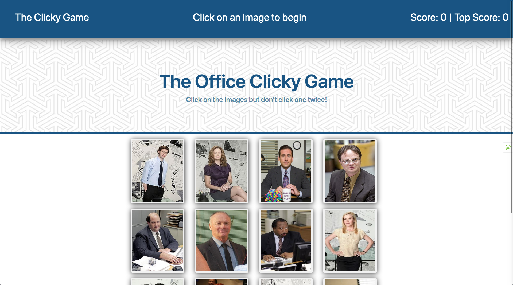
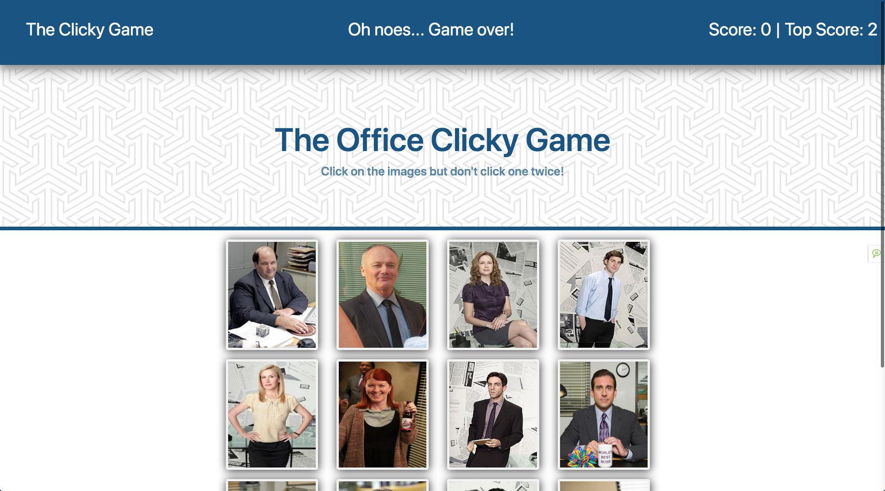
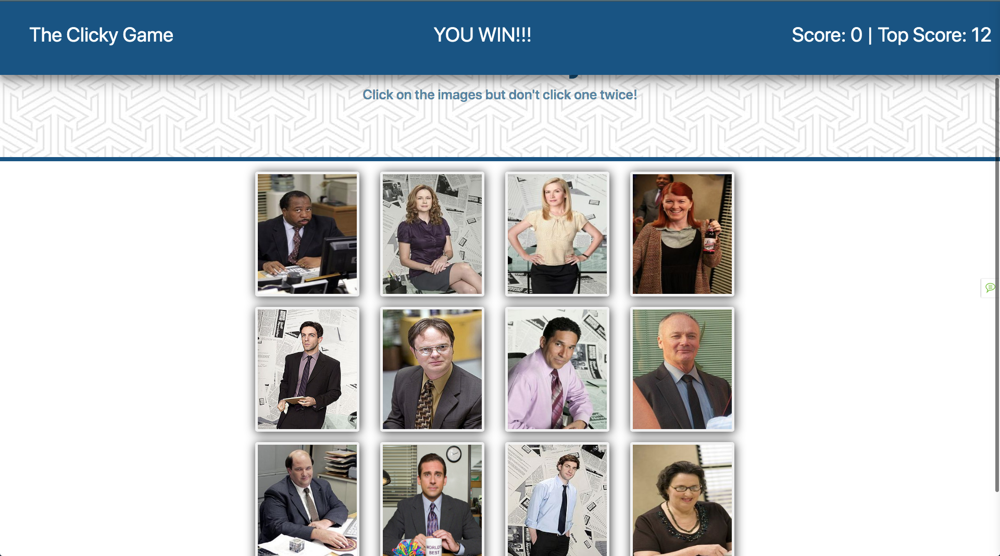

## The Office Clicky Game

Homework project to build a customized app with React.js.  Click on a card and the cards shuffle then if you click on the card twice you 
lose.  If you get all 12 right it states you win and resets the game.

### Start of Game

### Losing the game

### Winning the game

### React
Used React.js to build the app.
